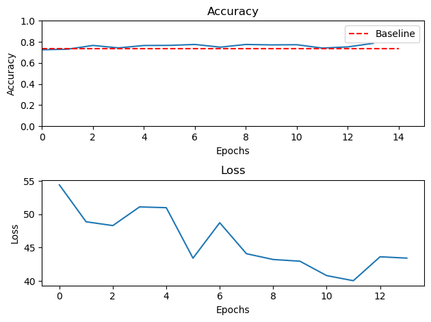
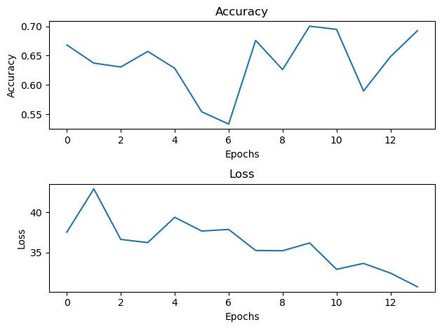
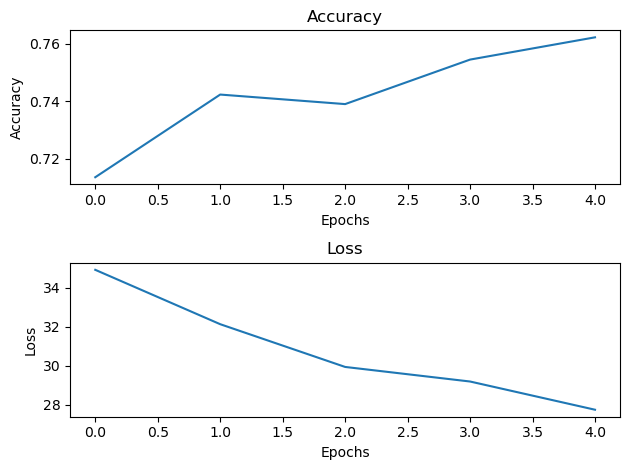

# Skin Cancer Experiment Log

## Description
 - Exploring the effects of class ordering on model performance to gain insight into optimal task ordering for devising a curriculum for continual learning
### 1. Dataset: 
 #### Name: ISIC 2019
 #### Classes: 8
 #### Hierarchy: 2 Levels
 #### Total Samples: 25,331
 #### Parent Classes: Melanocytic, Non-Melanocytic
 #### Child Classes: 
 1. Melanoma
 2. Melanocytic Nevus
 3. Basal Cell Carcinoma
 4. Actinic Keratosis
 5. Benign Keratosis
 6. Squamous Cell Carcinoma
 7. Vascular Lesion
 8. Dermatofibroma

    | Melanocytic | Number of Samples | Non-Melanocytic | Number of Samples |
    | :---:       | :--:              | :---:           | :--:              | 
    | 1. Melanocytic Nevus|12,875  | 1. Basal Cell Carcinoma| 3,323|
    | 2. Melanoma | 4,552|2. Benign Keratosis | 2,624|
    | - | - | 3. Actinic Keratosis| 867|
    | - | - |4. Squamous Cell Carcinoma |628 |
    | - | - |5. Vascular Lesion| 253 |
    | - | - |6. Dermatofibroma| 239 |

## Index
| **Experiment Name**| **Experiment-ID**      | **Aim** | **Hypothesis**     | **Reference File** | 
|:-: | :-:        |    :-----:     |          :-----:     |    :-:       |
| Melanocytic Nevus vs Melanoma | [melanocytic_exp1](#melanocytic-nevus-vs-melanoma)    | *To ascertain the distinguishability between Melanoma and Melanocytic Nevus*        | As per literature, these two classes appear almost identical visually and evolution of the nevi is required for final classification   | melanocytic_exp1.ipynb| 
| Melanocytic Nevus vs Melanoma (balanced) | [melanocytic_exp2](#melanocytic-nevus-vs-melanoma-balanced)    | *To ascertain the distinguishability between Melanoma and Melanocytic Nevus with balanced number of samples per class*        | Melanoma and Melanocytic Nevus are hard to distinguish. We aim to see roughly 50% accuracy for the binary classification task with the above two classes after balancing each class.   | melanocytic_exp2.ipynb|
|Melanoma vs Dysplastic Nevi | [dysplastic_nevus_exp1](#melanoma-vs-dysplastic-nevi) | *To ascertain the distinguishibility between melanoma and dysplastic nevus* | Dysplastic nevus and splitz nevus are two classes under the parent class of Melanocytic Nevus which are the most similar to melanoma, we suspect these classes are negatively affecting the model performance due to similar appearance to melanoma. We want to determine if it is possible to distinguish melanoma from the above 2 classes and we wish to investigate if doing so yields any clinically relevant concepts.| dysplastic_nevus_exp1.ipynb|
|Melanoma vs Dysplastic Nevi 2|[dysplastic_nevus_exp2](#melanoma-vs-dysplastic-nevi-2) |To ascertain the effect of a lower learning rate on stability of training an final testing accuracy on the distinguishibility between melanoma and dysplastic nevus. | A lower learning rate would allow for a more stable training process and final accuracies for each class will be around 50% | dysplastic_nevus_exp2.ipynb|
|Melanoma Screening|[melanoma_screening_exp1](#melanoma-screening) | To construct an ensemble classifier for melanoma screening| An ensemble of binary classifiers can be used for accurate melanoma screening| melanoma_screening_exp1.ipynb |
|Melanoma Screening rule-based|[melanoma_screening_exp2](#melanoma-screening-2) | To refine the previous classifier based on a human added rule based decision system| The decision making process of the ensemble can be improved by using a rule-based system constructed from literature and this will help alleviate the confusion between the classes| melanoma_screening_exp2.ipynb |

## **Melanocytic Nevus vs Melanoma**
### **Aim**
 -  To ascertain the distinguishability between Melanoma and Melanocytic Nevus  
### **Procedure**
 - We train a binary classifier on Melanoma vs Melanocytic Nevus
 #### *Experiment Details*
  1. **Architecture:** ResNet101
  2. **Train Epochs:** 14 
  3. **Optimizer:** *SGD*, *lr*: 0.001, *momentum*: 0.9
  4. **Loss:** *CrossEntropyLoss*, unweighed
  5. **Additional:** 
   - Images are resized to 224x224 to meet ResNet Specifications
   - Model was retrained from scratch
### **Observation**
 - As per the hypothesis, poor accuracy was expected. However, the final test accuracy came out to be 79% on the stratified test set.
 - A closer inspection of the dataset reveals that the classes themselves have a ratio of $73.8:26.2$ (Melanocytic Nevus to Melanoma).
 - Thus, the baseline for comparision has to be 74% and not 50% as is usually done for binary classification.

 

    

    

    <figure id="fig1"> 
    
    <figcaption>
Fig.1 Accuracy Loss Curve for MEL vs NEV
</figcaption>
    </figure>
    

    

    <figure id="fig2"> 
    
    <figcaption>
Fig.2 Accuracy Comparision with Balanced Baseline
</figcaption>
    </figure>
    

    

 

 - From [Figure 1](#fig1) We notice the accuracy jitters around 0.76. [Figure 2](#fig2) draws our attention to the fact that the accuracy obtained is indeed very poor when considering the class imbalance of the dataset. The accuracy is barely above the threshold!
 #### *Classise Accuracy*

 |Class|Accuracy|
 |:----|---:|
 |1. Melanocytic Nevus|94.3%|
 |2. Melanoma |34.1%|
 - The classwise accuracy seems to be skewed heavily in favour of Melanocytic nevus. However, it is not as if the model is making random predictions for either class.

### **Conclusion**
 - The above results provide circumstantial evidence of Melanoma not being distinguishable from Melanocytic nevus.
 - Although it provides a strong base for further experimentation on there distinguishing capability after balancing, it is possible that the model may have been motivated to predict Nevus due to imbalance. 
 - Thus, preliminary results indicate that these two classes are not sufficiently distinguishable from each other. Due to an imbalance in the number of sample, the predictions are skewed towards Nevus (high recall (94% accuracy)) in comparision to Melanoma (low recall (34% accuracy)).

## **Melanocytic Nevus vs Melanoma (balanced)**
### **Aim**
 -  To ascertain the distinguishability between Melanoma and Melanocytic Nevus with balanced number of samples per class 
### **Procedure**
 - Continuing from the previous Experiment, we explore the distinguishability of Melanoma and Melanocytic Nevus. This time the experiments are performed on a balanced dataset
 - We restrict number of samples in Melanocytic Nevus to the first 4,552 images.
 - Shuffling before sampling is not necessary since the order within the dataset is random.
 - We train a binary classifier on Melanoma vs Melanocytic Nevus.
 #### *Experiment Details*
  1. **Architecture:** ResNet101
  2. **Train Epochs:** 14 
  3. **Optimizer:** *SGD*, *lr*: 0.001, *momentum*: 0.9
  4. **Loss:** *CrossEntropyLoss*, unweighed
  5. **Additional:** 
   - Number of samples per class was fixed to 4,552
   - Images are resized to 224x224 to meet ResNet Specifications
   - Model was retrained from scratch.
### **Observation**
 - The original hypothesis regarding Melanoma and Melanocytic Nevus being indistinguishable is confirmed
 - Although we didn't obtain an accuracy of 50% as expected, scores were still somewhat low
  

    

    

    <figure id="fig3"> 
    
    <figcaption>
Fig.1 Accuracy Loss Curve for MEL vs NEV
</figcaption>
    </figure>
    

    

    <figure id="fig4"> 
    
    <figcaption>
Fig.2 Accuracy Comparision with Balanced Baseline
</figcaption>
    </figure>
    

    

 

 - [Figure 1](#fig3) The accuracy seems to always be above 50% meaning that we perform better than a random classifier. [Figure 2](#fig4) shows that this time the performance is always significantly above the 50% threshold apart from a single dip to 55%. However, this does not change the fact that a performance drop of almost 15% from [the previous experiment](#melanocytic-nevus-vs-melanoma) has been observed.
 #### *Classise Accuracy*

 |Class|Accuracy|
 |:----|---:|
 |1. Melanocytic Nevus|54.6%|
 |2. Melanoma |83.8%|

 |Mean Accuracy|Standard deviation|
 |:--:|:--:|
 |63.83%|4.69%|

 - The most interesting observation is the reversal of classwise accuracy scores for each class
 - This time, Melanoma performs far better (high recall (83.8% accuracy)) than Melanocytic Nevus (low recall (54.6% accuracy))
 - Classwise accuracy seems to be in favour of Melanoma as opposed to Melanocytic nevus when the samples are balanced.
 - Thus, Melanoma is easier to identify compared to Nevus, perhaps because it is present in an advanced stage in the dataset (see )

### **Conclusion**
 - Due to the switch in performance on the balanced dataset along with the low overall accuracy for a binary classification task, it can be concluded that Melanoma is not sufficiently distinguishable from melanocytic nevus. 
 - Roughly half the total Melanocytic Nevus samples are being misclassified.
 - On the other hand, the model seems good at identifying melanoma now. 
 
### **Further Analysis**
 *Note that this section contains plans for further analysis and not an extended analysis*
 
 - Comparing with the result of [the previous experiment](#melanocytic-nevus-vs-melanoma), it would seem that training against Melanoma after balancing the samples provides us with a good feature extractor for Melanoma.
 - This may have use in further experiments to retain the superclass label melanocytic across tasks.
 - Since these two are the largest occuring classes in the dataset, training this classification as the first task may serve a similar goal as EWC since due to lesser number of samples, the model will be unwilling to let go of previous task knowledge.
 - This can be confirmed by training with a reduced number of samples for the Melanoma vs Melanocytic Nevus case and seeing a negative trend for backward interference on the first task.
 - Another good idea would be seeing the effictiveness of this feature extractor for melanoma as compared to the previous obtained feature extractor for Nevus (presumably, since the performance on Nevus was high)
 - A line of questioning worth pursuing is that if these two classes are supposed to be visually indistinguishable for the most part, which samples are being classified consistently across runs? We know dysplastic nevi are similar to Melanoma, is it possible other samples such as blue Nevi may be present under the Melanocytic Nevus class? If this is the case, then are roughly 50% of the samples dysplastic Nevus since the classwise accuracy for nevus is only 54.6%? 
 - Explaining these result will provide significant insight into to exactly what the model has learnt about each class and will help us take a step towards the end goal of devising a curriculum for ordering tasks in continual learning, hopefully to achieve either better performance or more explainable models.

## **Melanoma vs Dysplastic Nevi**
### **Aim**
 -  To ascertain the distinguishibility between melanoma and dysplastic nevus 
### **Procedure**
 - In this experiment we determine which samples in the Melanocytic nevus class were mislabelled as Melanoma by the classifier trained in [the previous experiment](#melanocytic-nevus-vs-melanoma-balanced).
 - We pass every misclassified nevus sample from `train_dataset` and `test_dataset` and store them in `train_dataset_refined` and `test_dataset_refined`
 - ~~The datasets are rebalanced to have an 90-10 ratio~~ Rebalancing was not required
 #### Dataset Stats before appending melanoma samples
 |Dataset| Number of Samples|
 |:---|---:|
 | `train_dataset_refined` | 4770 |
 | `test_dataset_refined` | 548 |

 #### Dataset Stats after appending melanoma samples
  |Dataset| Number of Samples|
  |:---|---:|
  | `train_dataset_refined` | 8840 |
  | `test_dataset_refined` | 1000 |

 #### *Experiment Details*
  1. **Architecture:** ResNet101
  2. **Train Epochs:** 14 
  3. **Optimizer:** *SGD*, *lr*: 0.001, *momentum*: 0.9
  4. **Additional:** 
   - Number of samples per class was fixed to 4770 for Melanocytic Nevus in train set and 548 in test set, while for Melanoma it was fixed to 4070 samples in the train set and 452 in the test set
   - Images are resized to 224x224 to meet ResNet Specifications
   - The model from [the previous experiment](#melanocytic-nevus-vs-melanoma-balanced) was used for identifying misclassified Melanocytic Nevus samples
   - Model was retrained from scratch.
### **Observation**
 - The original hypothesis regarding Melanoma and Melanocytic Nevus being indistinguishable has been modified
 - Instead of these classes being indistinguishable from each other as a whole, we observere that a specific subclass within melanocytic nevus is indistinguishable from melanoma
 - This is true as the accuracy for the class Melanoma is abysmally low [see table](#classise-accuracy-2).  
 - Low scores indicate atleast 50% of all samples are misclassified with the rest being classified purely by chance/guesswork (suspected). 
  

    

    

    <figure id="fig5"> 
    
    <figcaption>
Fig.1 Accuracy Loss Curve for MEL vs DYS_NEV
</figcaption>
    </figure>
    

    

    <figure id="fig6"> 
    
    <figcaption>
Fig.2 Accuracy Comparision with Balanced Baseline
</figcaption>
    </figure>
    

    

 

 - [Figure 1](#fig5) The accuracy seems to always be above 50% meaning that we perform better than a random classifier. [Figure 2](#fig6) This time the performance dipped multiple times to 55% and below (53%). The gross accuracy remains the same as [the previous experiment](#melanocytic-nevus-vs-melanoma-balanced).
 #### *Classise Accuracy*

 |Class|Accuracy|
 |:----|---:|
 |1. Melanocytic (dysplastic suspected) Nevus|94.2%|
 |2. Melanoma |24.1%|

 |Mean Accuracy|Standard deviation|
 |:--:|:--:|
 |61.78%|4.66%|

### **Conclusion**
 - Once again, the classwise accuracies seem to have been reversed
 - This time, dysplastic (suspected) nevus performs far better (high recall (94.2% accuracy)) than Melanoma (low recall (24.1% accuracy))
 - Classwise accuracy seems to be in favour of Dysplastic Nevus as opposed to Melanoma even though the samples are balanced, meaning. 
 - The shift toward nevi could be attributed to a marginally higher number of samples present in the dataset for nevi as compared to melanoma (4770 vs 4070)
- *It would seem that there exists a class within melanocytic nevus which makes binary classification between melanoma and nevus difficult leading a classifier to make random predictions. Further experiments with a lower learning rate, higher resolution and additon of metadata are necessary for conclusive evidence but for the time being it can be assumed that such a sub-class exists.*

## **Melanoma vs Dysplastic Nevi 2**
### **Aim**
 -  To ascertain the effect of a lower learning rate on stability of training an final testing accuracy on the distinguishibility between melanoma and dysplastic nevus. 
### **Procedure**
 - In this experiment we determine which samples in the Melanocytic nevus class were mislabelled as Melanoma by the classifier trained in [the previous experiment](#melanocytic-nevus-vs-melanoma-balanced).
 - We pass every misclassified nevus sample from `train_dataset` and `test_dataset` and store them in `train_dataset_refined` and `test_dataset_refined`
 - ~~The datasets are rebalanced to have an 90-10 ratio~~ Rebalancing was not required
 - **The learning rate is reduced to 0.0001**
 #### Dataset Stats before appending melanoma samples
 |Dataset| Number of Samples|
 |:---|---:|
 | `train_dataset_refined` | 4770 |
 | `test_dataset_refined` | 548 |

 #### Dataset Stats after appending melanoma samples
  |Dataset| Number of Samples|
  |:---|---:|
  | `train_dataset_refined` | 8840 |
  | `test_dataset_refined` | 1000 |

 #### *Experiment Details*
  1. **Architecture:** ResNet101
  2. **Train Epochs:** 14 
  3. **Optimizer:** *SGD*, *lr*: 0.00001, *momentum*: 0.9
  4. **Additional:** 
   - Number of samples per class was fixed to 4770 for Melanocytic Nevus in train set and 548 in test set, while for Melanoma it was fixed to 4070 samples in the train set and 452 in the test set
   - Images are resized to 224x224 to meet ResNet Specifications
   - The model from [the previous experiment](#melanocytic-nevus-vs-melanoma-balanced) was used for identifying misclassified Melanocytic Nevus samples
   - Model was retrained from scratch.
### **Observation**
 - The training is a lot more stable as can be seen from the lower standard deviation in the accuracy loss curve
 - The final classwise accuracies are a lot closer to each other and to the 50% threshold.
 - The samples are present in a 53:47 ratio in favour of Melanocytic Nevus
 - The classwise accuracies are in a ration of 55.8:44.2 in favour of Melanocytic Nevus closely resembling the ratio of samples in the dataset
  

    

    

    <figure id="fig7"> 
    
    <figcaption>
Fig.1 Accuracy Loss Curve for MEL vs DYS_NEV
</figcaption>
    </figure>
    

    

    <figure id="fig8"> 
    
    <figcaption>
Fig.2 Accuracy Comparision with Balanced Baseline
</figcaption>
    </figure>
    

    

 

 - [Figure 1](#fig7) The accuracy seems to always be above 50% meaning that we perform better than a random classifier. [Figure 2](#fig8) This time the performance is a lot more stable as compared to [the previous experiment](#melanoma-vs-dysplastic-nevi). The gross accuracy is a lot lower than the previous experiment.
 #### *Classise Accuracy*

 |Class|Accuracy|
 |:----|---:|
 |1. Melanocytic (dysplastic suspected) Nevus|67.0%|
 |2. Melanoma |53.1%|

 |Mean Accuracy|Standard deviation|
 |:--:|:--:|
 |58.52%|3.14%|

 #### *Visualizations*
 

    

    

    <figure id="fig9"> 
    
    <figcaption>
Fig.1 Some Samples visualized for MEL vs DYS_NEV with GT Labels and Predicted Labels
</figcaption>
    </figure>
    

    

    <figure id="fig10"> 
    
    <figcaption>
Fig.2 Some more samples visualized
</figcaption>
    </figure>
    

    

    <figure id="fig11"> 
    
    <figcaption>
Fig.3 Some more samples visualized
</figcaption>
    </figure>
    

    

    <figure id="fig12"> 
    
    <figcaption>
Fig.4 Some more samples visualized
</figcaption>
    </figure>
    

    

 

 
 - As can be seen from the above figures, the images themselves are not very distinguishable from each other. For instance (all of these are from observation and not from a trained dermatologist and thus may not be accurate):

 |Figure|Row|Col| Gt Label|Predicted|Observation/Scrutiny |
 |:---:|:---:|:---:|:---:|:---:|:-----:|
 |[Figure 2](#fig10)|1|1|Melanocytic Nevus | Melanoma|From the figure, we the color variegation characteristic of Melanoma along with the atypical streaks/stardust pattern|
 |[Figure 3](#fig11)|2|1 and 3|Melanoma and Melanocytic Nevus |Melanocytic Nevus and Melanocytic Nevus |Apart from the slight pinkish presence on image in col 1 in the bottom right side, the two images present roughly the same characteristics|
 |[Figure 3](#fig11)|1| 3|Melanocytic Nevus |Melanocytic Nevus|To the untrained eye, this seems like Melanoma, we can see the atypical streaks and color variegation along with asymmetry|
 |[Figure 2](#fig10)|2|1 and 5|Melanoma and Melanocytic Nevus | Melanocytic Nevus and Melanocytic Nevus|Apart from the presence of atypical blotch, blue white veil and regression structure/ white scar-like depigmentation on image in col 1, the images present a similar pattern|

 

 - **This table can be expanded as more knowledge is gained**

### **Conclusion**
 - Melanoma presents characteristic dermoscopic patters, however, these patterns are not unique to melanoma, rather they are also present in a subclass of Melanocytic Nevus (so far).
 - We suspect these concepts to be true for other classes as well, however, we have not yet explored them.
 - The aim is to guide the network to learn these patterns and distinguish between the classes via a training regime which gradually builds up its distinguishing ability.
 - This can be done via continual learning
 - One major problem encountered in continual learning is catastrophic forgetting, which is the tendency of neural networks to forget previously learned information when learning new information.
 - In our case, we want the previously learnt concepts to complement the newer concepts. At each step the classifier must sequentially test for the presence of previously learnt concepts before attempting to learn a new one.
 - Further research is required to explore this avenue.

 ## **Melanoma Screening**

 ### **Aim**
 - To construct an ensemble classifier for melanoma screening

 *Reader's Note: For future reference the ensemble classifier thus obtained will be referred to as `ensemble v1.0`*

### **Procedure**
 - For this experiment, we will be constructing a 3 class classifier which will specialize in melanoma screening
 - ~~To this end we use the classifier from [the previous experiment](#melanoma-vs-dysplastic-nevi-2) for the first stage of classification between melanoma and melanocytic nevus~~ We finetune an imageNet pretrained model for melanoma vs melanocytic nevus classification
 - We then train another binary classifier between melanoma and seborrheic keratosis
 - For each of the models, we stop after 14 epochs regardless of performance
 - An ensemble decision making system is used to act as the screener which combines the above classifiers to screen for melanoma
 - `ensemble v1.0` is constructed by combining the above classifiers using a majority voting system $\rightarrow$ **(1)** If either classifier predicits Melanoma then suspected Melanom, thus output prediction will be Melanoma
 $\rightarrow$ **(2)** If both classifiers don't predict Melanoma then we output the class with the higher softmax probability (i.e. the class with the higher confidence)
 - Clearly, this method has a fundamental flaw for the case when either classifier doesn't predict Melanoma. 
 - The tie breaking doesn't take into account the similarity between the sample's class and Melanoma. If a sample' similarity is higher to Melanoma, an appropriate weight should be assigned to it's class probability.
 - Choosing such a weight is non-trivial and we leave it to the next experiment.
 - **The learning rate is increased to 0.0001**
 #### Dataset Stats for melanoma vs bkl samples
 |Dataset| Number of Samples per class|
 |:---|---:|
 | `train_dataset` | 2361 |
 | `test_dataset` | 263 |

 #### Dataset Stats for melanoma vs bkl vs nevus samples (final dataset)
 |Dataset| Number of Samples per class|
 |:---|---:|
 | `train_dataset` | 2361 |
 | `test_dataset` | 263 |

 #### Dataset Stats for melanoma vs nevus samples
 |Dataset| Number of Samples per class|
 |:---|---:|
 | `train_dataset` | 4070 |
 | `test_dataset` | 452 |

 - The samples are split into train and test sets in the ratio 9:1
 - The samples in each set are **perfectly balanced** as per their class labels and **randomly sampled** for each of the 3 datasets.

 #### *Experiment Details*
  - *Note that the architecture and all other hyperparameters remain the same for all 3 models*
  1. **Architecture:** ResNet101
  2. **Train Epochs:** 14 
  3. **Optimizer:** *SGD*, ~~*lr*: 0.00001~~, *lr*: 0.0001, *momentum*: 0.9
  4. **Additional:** 
   - Images are resized to 224x224 to meet ResNet Specifications
   - **Color constancy is applied to this dataset and each of the 3 models are finetuned from an imageNet pre-trained model, however, [the previous model](#melanoma-vs-dysplastic-nevi-2) was trained without applying color constancy**
   - ~~The model from [the previous experiment](#melanocytic-nevus-vs-melanoma-balanced) was used for identifying misclassified Melanocytic Nevus samples~~ All models were finetuned from resnet101 pretrained on ImageNet
### **Observation**
 - ImageNet pretraining certainly helped improve the performance of the model
 - The final classwise accuracies for each model are above the 50% mark for binary classification and above the 33% mark for the single case of 3-class classifcation (see [table-1](#classise-accuracy-5), [table-2](#classise-accuracy-6) and [table-3](#classise-accuracy-7))
  

    

    <figure id="fig13"> 
    
    <figcaption>
Fig.1 Accuracy Loss Curve for MEL vs BKL
</figcaption>
    </figure>
    

 

 - [Figure 1](#fig13) ~~Reported standard deviation is low, however, there are some dips in the accuracy curve~~With imageNet pre-training the model performs far better

 ### Melanoma vs Benign Keratosis
 #### *Classise Accuracy*

 |Class|Accuracy|
 |:----|---:|
 |1. Benign Keratosis|69.6%|
 |2. Melanoma |74%|

 |Mean Accuracy|Standard deviation| Final Test accuracy|
 |:--:|:--:|:--:|
 |68.94%|4.69%| 72%|

  

    

    <figure id="fig14"> 
    
    <figcaption>
Fig.2 Accuracy Loss Curve for MEL vs BKL vs NEV
</figcaption>
    </figure>
    

 

 - [Figure 2](#fig14) ~~Performance of the three class classifier is quite low, perhaps imagenet pre-training + finetuning is required to improve performance~~ finetuned all models with imageNet pretraining
 

 ### Melanoma vs Benign Keratosis vs Melanocytic nevus (randomly sampled)
 #### *Classise Accuracy*
 |Class|Accuracy|
 |:----|---:|
 |1. Benign Keratosis|53.2%|
 |2. Melanoma |60.1%|
 |3. Melanocytic Nevus |73.4%|

 |Mean Accuracy|Standard deviation| Final Test accuracy|
 |:--:|:--:|:--:|
 |61.05%|3.73%| 64%|

  

    

    <figure id="fig15"> 
    
    <figcaption>
Fig.3 Accuracy Loss Curve for MEL vs NEV
</figcaption>
    </figure>
    

 

 - [Figure 3](#fig15) Classifier is able to distinguish between Melanoma and Melanocytic Nevus with a reasonable accuracy

 ### Melanoma vs Melanocytic nevus (randomly sampled)
 #### *Classise Accuracy*
 |Class|Accuracy|
 |:----|---:|
 |1. Melanoma |77%|
 |2. Melanocytic Nevus |75.4%|

  |Mean Accuracy|Standard deviation| Final Test accuracy|
 |:--:|:--:|:--:|
 |74.23%|1.66%| 76%|

 ### Ensemble Classifier ((Melanoma vs Melanocytic nevus) + (Melanoma vs Benign Keratosis))
 #### *Classise Accuracy*
 |Class|Accuracy|
 |:----|---:|
 |1. Melanoma |82.13%|
 |2. Melanocytic Nevus |56.27%|
 |3. Benign Keratosis|33.4%|

#### *Confusion Matrix*
|Name|Melanoma|	Nevus|	Seborrheic Keratosis|
|:----:|:--:|:--:|:--:|
|Melanoma|	0.828897 |	0.091255 |	0.079848 |
|Nevus|	0.372624 |	0.528517 |	0.098859 |
|Seborrheic Keratosis|	0.517110 |	0.148289 |	0.334601 |

 - We limit our comparision to `ensemble v1.0` and the joint classifier
 - Accuracy for Melanoma Detection is 22% higher in the ensemble classifier when compared to the final test accuracy of the joint classifier and 17% higher than its max accuracy 
 - Consequently a 17% drop is observed in the accuracy of Melanocytic Nevus and a 20% drop in the accuracy of Benign Keratosis

### **Conclusion**
 - The accuracy for melanoma detection increased quite significantly at the cost of a drop in the accuracy of the other two classes
 - The drop in the accuracy of the other two classes could possibly be attributed to a fault in the tie-breaking mechanism of the ensemble classifier
 - To this end we also reported the Confusion Matrix `ensemble v1.0`.
 - Unfortunately, the false positives for melanoma seems to be very high and we've only managed to mitigate the false negatives to a certain extent
 - A staggering 52% of Benign keratosis samples were misclassified as Melanoma while a moderate 37% of Melanocytic Nevus samples were misclassified as Melanoma
 
### **For the Future**
 - `ensemble v1.0` is a very naive implementation of an ensemble classifier, we could possibly improve the performance of the classifier by using a more robust tie-breaking mechanism
 - Melanoma false negatives can be corrected by classwise similarity/tsne evaluation and assigning a weight to each model's melanoma prediction
 - It can also be a sequential check, if one of the models with a higher weight classifies a samples as melanoma, the model will enter a suspected melanoma stage and a further analysis can be done to confirm the prediction
 - Tie-breaking for Nevus and Benign Keratosis can be improved by the same method
 - Improving `ensemble v1.0`'s evaluation method by simpler means is required before involving metadata and concept information. 

## **Melanoma Screening 2**

 ### **Aim**
 - To refine the previous classifier based on a human added rule based decision system

 *Reader's Note: For future reference the ensemble classifier thus obtained will be referred to as `ensemble v1.1`*

### **Procedure**
 - We refine [ensemble v1.0](#melanoma-screening) by adding a rule based decision system constructed from literature with the following rules:
   #### **Ensemble v1.1**
   ##### *Salient Features*
   1. New Decision making system based on medical literature
   2. Human engineered tie-breaking and decision making
   ##### *Decision Making Procedure*
   1. If Melanoma vs Nevus model predicts Nevus, and Benign Keratosis vs Melanoma model predicts Melanoma, then classify as Nevus since a nevus sample would look like a Melanoma sample to the Benign Keratosis vs Melanoma model
   2. If Melanoma vs Nevus model predicts Melanoma and Benign Keratosis model predicts Benign Keratosis, then classify as Benign Keratosis as Benign Keratosis model can distinguish between Melanoma and Benign Keratosis reasonably well
   3. If Melanoma vs Nevus model predicts Melanoma and Benign Keratosis model predicts Melanoma then it is very likely to be Melanoma
   4. If Melanoma vs Nevus model predicts Nevus and Benign Keratosis model predicts Benign Keratosis then there is an ambiguity for the sample, it is most certainly not Melanoma. Since a Nevus sample would appear to be Melanoma to BKL classifier, in case of such an ambiguity, we classify the sample as Benign Keratosis

 #### Dataset Stats for melanoma vs bkl vs nevus samples (test dataset used)
 |Dataset| Number of Samples per class|
 |:---|---:|
 | `train_dataset` | 2361 |
 | `test_dataset` | 263 |

 - The samples are split into train and test sets in the ratio 9:1
 - The samples in each set are **perfectly balanced** as per their class labels and **randomly sampled** for each of the 3 datasets.

 #### *Experiment Details*
  - *Note 1: the architecture and all other hyperparameters remain the same for all 3 models*
  - *Note 2: To [ensemble v1.0](#melanoma-screening) we add a rule based decision making system as described above, **nothing else is changed***
  1. **Architecture:** ResNet101
  2. **Train Epochs:** 14 
  3. **Optimizer:** *SGD*, *lr*: 0.0001, *momentum*: 0.9
  4. **Additional:** 
   - Images are resized to 224x224 to meet ResNet Specifications
   - **Color constancy is applied to this dataset and each of the 3 models are finetuned from an imageNet pre-trained model, however, [the previous model](#melanoma-vs-dysplastic-nevi-2) was trained without applying color constancy**
   - All models were finetuned from resnet101 pretrained on ImageNet
### **Observation**
 - From the results it seems we have traded specificity for sensitivity

 ### Ensemble Classifier ((Melanoma vs Melanocytic nevus) + (Melanoma vs Benign Keratosis))
 #### *Classise Accuracy*
 |Class|Accuracy|
 |:----|---:|
 |1. Melanoma |82.13%|
 |2. Melanocytic Nevus |56.27%|
 |3. Benign Keratosis|33.4%|

#### *Confusion Matrix*
|Name|Melanoma|	Nevus|	Seborrheic Keratosis|
|:----:|:--:|:--:|:--:|
|Melanoma|		0.589354 |	0.163498 |	0.247148 |
|Nevus|	0.133080 |	0.422053 |	0.444867 |
|Seborrheic Keratosis|	0.254753 |	0.049430 |	0.695817 |

 - We limit our comparision to `ensemble v1.1` and `ensemble v1.0`
 - Accuracy for Melanoma Detection in `ensemble v1.1` is 24% lower than `ensemble v1.0`
 - Accuracy for Nevus Detection in `ensemble v1.1` is 14% lower than `ensemble v1.0`
 - Accuracy for Benign Keratosis Detection in `ensemble v1.1` is 36% higher than `ensemble v1.0`

### **Conclusion**
 - The accuracy for melanoma detection dropped to subpar leveles
 - The drop in the Melanocytic nevus is quite clearly due to its confusion with Benign keratosis
 - This can be seen from the fact that 42% of the Nevus samples were misclassified as Benign Keratosis
 - The accuracy for Benign Keratosis detection increased by 36% which is a significant improvement
 - The only time Benign keratosis is misclassified is when it is confused with Melanoma
 - Melanoma is incorrectly confused with Benign Keratosis 25% of the time
 - Melanoma is incorrectly confused with Nevus 16% of the time
 - The reduction in individual confusion rates are a very positive result and we can thus move forward with our hypothesis 
 
### **For the Future**
 - `ensemble v1.0` is a very naive implementation of an ensemble classifier, we could possibly improve the performance of the classifier by using a more robust tie-breaking mechanism
 - Melanoma false negatives can be corrected by classwise similarity/tsne evaluation and assigning a weight to each model's melanoma prediction
 - It can also be a sequential check, if one of the models with a higher weight classifies a samples as melanoma, the model will enter a suspected melanoma stage and a further analysis can be done to confirm the prediction
 - Tie-breaking for Nevus and Benign Keratosis can be improved by the same method
 - Improving `ensemble v1.0`'s evaluation method by simpler means is required before involving metadata and concept information. 
